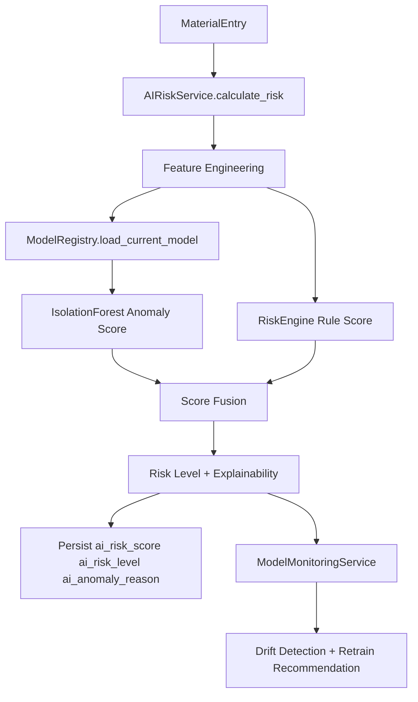

# Unified AI Risk Intelligence

## Architecture Diagram

## New File Structure

- app/services/ai_risk_service.py
- app/services/model_registry.py
- app/services/model_monitoring.py
- app/api/ai.py
- app/schemas/ai.py
- models/metadata.json
- tests/test_ai_risk_engine.py

Model artifacts are created in models/ as:
- anomaly_model_v1.pkl
- anomaly_model_v2.pkl
- metadata.json

## Unified Risk Engine

The unified service combines ML anomaly scoring and rule scoring into one pipeline.

Output contract:

- anomaly_score
- rule_score
- combined_score
- risk_level (LOW, MEDIUM, HIGH)
- explanation (triggered factors)
- top_contributing_features
- deviation_details

Score fusion:

- combined_score = 0.55 * anomaly_score + 0.45 * rule_score

Risk levels:

- LOW: combined_score < 0.35
- MEDIUM: 0.35 <= combined_score < 0.65
- HIGH: combined_score >= 0.65

## Model Lifecycle

### Train

Endpoint: POST /ai/train

- fetches historical material entries
- generates feature matrix
- trains IsolationForest
- persists anomaly_model_vN.pkl
- updates models/metadata.json

### Retrain

Endpoint: POST /ai/retrain

- follows same flow as train
- increments model version

### Status

Endpoint: GET /ai/model-status

- returns current model metadata
- includes monitoring summary and drift signal

### Rollback

Endpoint: POST /ai/rollback?model_name=anomaly_model_v1.pkl

- switches active model to target version in metadata

## Feature Engineering

Implemented features:

- quantity
- expected_quantity
- difference_ratio
- emission_value
- supplier_frequency
- historical_entry_count
- material_type_encoding
- time_since_last_submission
- emission_deviation_from_project_average

## Monitoring Strategy

Endpoint: GET /ai/monitoring

Monitors:

- anomaly_rate
- false_positive_rate
- score_distribution
- drift_detection

Drift detection compares recent score behavior to baseline training distribution and recommends retraining when threshold is exceeded.

## Backward Compatibility

The following are preserved:

- /analysis/* endpoints remain available
- workflow verification still persists ai_risk_score, ai_risk_level, ai_anomaly_reason
- dashboard risk reporting continues reading existing fields

Compatibility adapters:

- app/services/ai/anomaly_detection.py now redirects material-entry scoring to AIRiskService
- app/services/anomaly_service.py now reads latest model from ModelRegistry and falls back to legacy artifact

## Retraining Policy

Use retraining when either condition holds:

- drift_detection.drift_detected is true
- anomaly_rate shifts by more than 20 percent from expected baseline

Operational recommendation:

- run weekly retraining in low-traffic windows
- roll back immediately if false_positive_rate increases significantly
